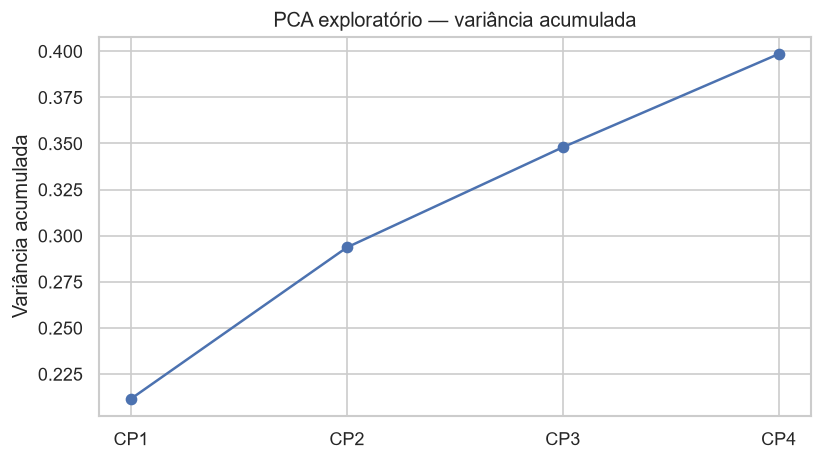

# Análise exploratória

Código: `notebooks/01_exploracao_inicial.ipynb`, `notebooks/02_eda.ipynb`
Figuras: `reports/figures/` e `docs/assets/figures/`
Tabelas: `reports/tables/eda_*.csv`

## Escopo da exploração

- Estrutura e tipos
- Qualidade (ausentes, constantes, identificadores)
- Distribuições de carreira e remuneração
- Distribuições categóricas e Likert
- Relação com `Attrition` e `PerformanceRating`
- Correlações Pearson e Spearman; V de Cramér entre nominais
- Discrepantes (Tukey) — mantidos
- PCA exploratório (diagnóstico, não substitui Gower)

## Resultados

| Observação | Detalhe |
|---|---|
| Taxa de attrition | 16,12% |
| Horas extras | `OverTime = Yes` associado a maior taxa de saída |
| Remuneração e idade | Médias inferiores entre quem sai |
| Satisfação | Níveis baixos nas escalas Likert associados a maior saída |
| Multicolinearidade | Spearman alto entre `JobLevel`, `MonthlyIncome` e `TotalWorkingYears` (ρ ≈ 0,92 renda × nível) |
| Nominais | `Department` × `JobRole` com V de Cramér ≈ 0,94 (redundância esperada) |
| Discrepantes | 7,8% da renda e 7,1% de `YearsAtCompany` fora de Tukey 1,5×IQR — **mantidos** |
| PCA | CP1+CP2 ≈ 29% da variância; problema não é unidimensional |
| Colunas não informativas | Três constantes e um identificador |

Coleção persistida: `reports/tables/eda_insights.csv`.

## Visualizações

### Carreira e remuneração

### Escalas Likert

### Attrition

### Attrition × renda, idade e tempo de empresa

### Taxa de saída por satisfação

### Correlação

### PCA exploratório

## Implicações para a modelagem

- Distância de Gower é adequada à mistura de tipos
- Redundância entre nível, renda, experiência e cargo×departamento: Gower trata tipos; não é obrigatório dropar colunas
- Hipóteses de perfil (alta carga, risco de saída, início de carreira, engajados) serão testadas nos clusters
- Outliers de renda não entram em corte de curadoria
