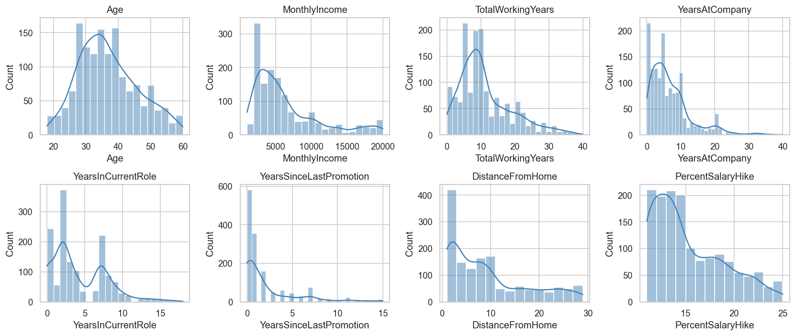
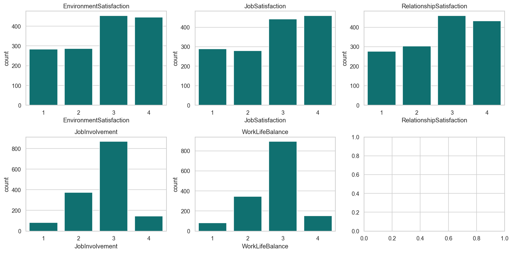
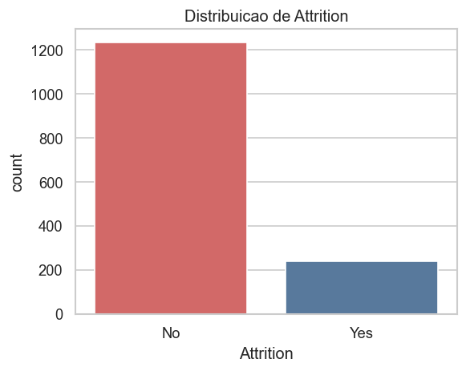
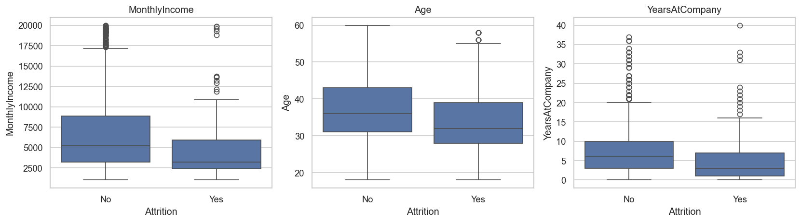
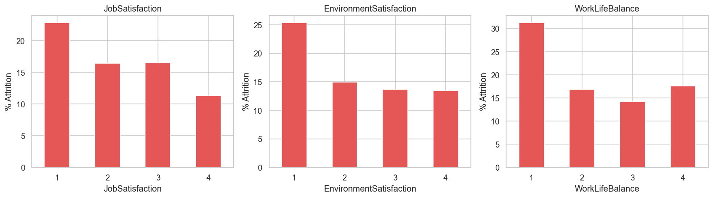
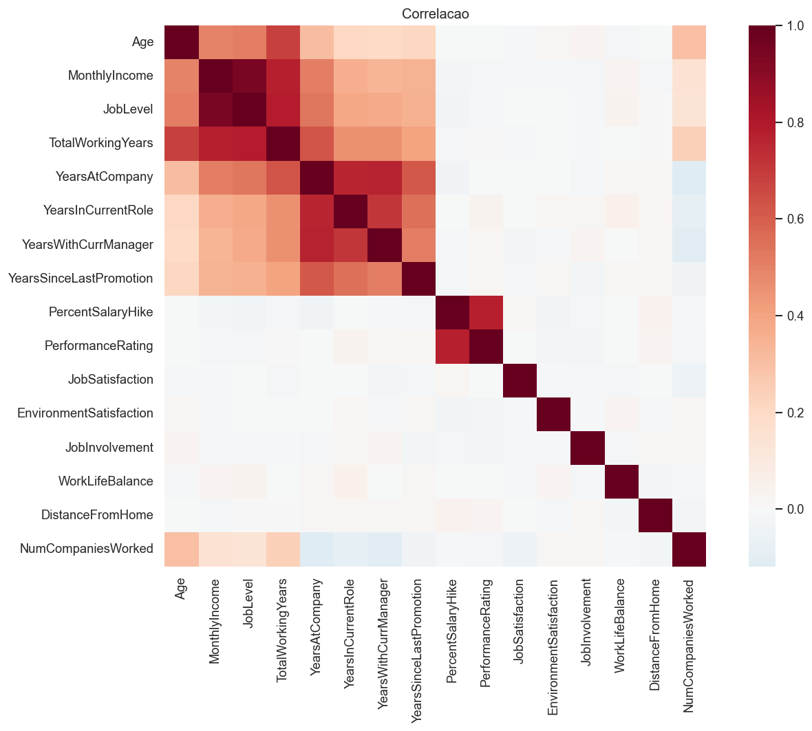

# Análise exploratória

Código: `notebooks/01_exploracao_inicial.ipynb`, `notebooks/02_eda.ipynb`
Figuras: `reports/figures/`

## Escopo da exploração

- Estrutura e tipos
- Qualidade (ausentes, constantes, identificadores)
- Distribuições de carreira e remuneração
- Distribuições categóricas e Likert
- Relação com `Attrition` e `PerformanceRating`
- Correlações entre variáveis numéricas

## Resultados

| Observação | Detalhe |
|---|---|
| Taxa de attrition | 16,12% |
| Horas extras | `OverTime = Yes` associado a maior taxa de saída |
| Remuneração e idade | Médias inferiores entre quem sai |
| Satisfação | Níveis baixos nas escalas Likert associados a maior saída |
| Multicolinearidade | Correlação elevada entre `JobLevel`, `MonthlyIncome` e `TotalWorkingYears` |
| Colunas não informativas | Três constantes e um identificador |

## Visualizações

### Carreira e remuneração

### Escalas Likert

### Attrition

### Attrition × renda, idade e tempo de empresa

### Taxa de saída por satisfação

### Correlação

## Implicações para a modelagem

- Distância de Gower é adequada à mistura de tipos
- Redundância entre nível, renda e experiência sugere PCA ou seleção de atributos
- Hipóteses de perfil (alta carga, risco de saída, início de carreira, engajados) serão testadas nos clusters
