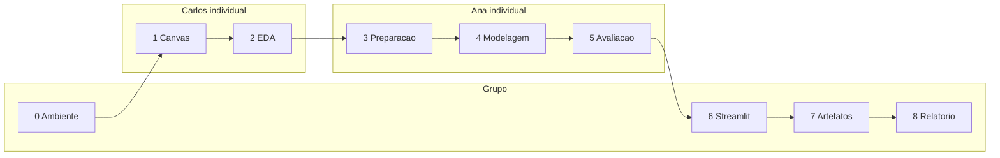

# Equipe e divisão dos critérios

Entrega da disciplina em **nove critérios** (0 a 8). Quatro são **em grupo**; cinco são **individuais**.

| Modalidade | Critérios |
|---|---|
| **Grupo** | 0, 6, 7 e 8 |
| **Individual** | 1, 2, 3, 4 e 5 |

Integrantes:

- **Carlos E. O. Martins** ([@carloseomartinsdev](https://github.com/carloseomartinsdev))
- **Ana Caroline Amorim** ([@amorinana](https://github.com/amorinana))

A divisão individual segue o CRISP-DM: Carlos responde pelo entendimento do problema e dos dados até a preparação; Ana responde pela modelagem e pela avaliação. Nos itens de grupo os dois participam; cada um **coordena** um recorte para a defesa não ficar sem dono.

---

## Mapa dos nove critérios

| # | Critério | Modalidade | Responsável na defesa | Onde no projeto |
|:-:|:---|:---|:---|:---|
| **0** | Repositório, ambiente funcional, dados brutos | Grupo | **Carlos** (coordenação) · Ana | `pyproject.toml`, `uv.lock`, `data/raw/`, README |
| **1** | Canvas do problema e perguntas orientadas a dados | Individual | **Carlos** | [Canvas](pbl/canvas-do-problema.md), [Quadro PBL](pbl/quadro-pbl.md), [negócio](entendimento-negocio.md) |
| **2** | Relatório de análise exploratória e insights | Individual | **Carlos** | notebooks `01`–`02`, [EDA](analise-exploratoria.md), `reports/tables/eda_*.csv` |
| **3** | Preparação dos dados | Individual | **Ana** | notebook `03`, [preparação](preparacao.md), `data/processed/`, tipologia |
| **4** | Construção da modelagem | Individual | **Ana** | notebook `04` (+ `07` bônus), [modelagem](modelagem.md), `src/model/` |
| **5** | Avaliação dos modelos | Individual | **Ana** | notebook `05`, [avaliação](avaliacao.md), personas e regras de associação |
| **6** | Aplicação Streamlit | Grupo | **Ana** (coordenação) · Carlos | `src/deployment/app.py`, `uv run invoke app` |
| **7** | Artefatos do repositório | Grupo | **Carlos** (coordenação) · Ana | GitHub, `reports/`, `models/`, MkDocs |
| **8** | Relatório final | Grupo | **Carlos** (coordenação) · Ana | [relatório](relatorio-final.md), notebook `06` |

---

## O que cada um defende

### Carlos E. O. Martins — critérios 1 e 2 (individuais) + coordenação 0, 7 e 8

| # | Entrega | Foco na defesa |
|:-:|:---|:---|
| 1 | Canvas e perguntas | Dor da política única, teto de 5 grupos, por que Attrition não entra no cluster |
| 2 | EDA e insights | OverTime, renda, Likert, Tukey (manter), Spearman, PCA exploratório |
| 0 | Ambiente (grupo) | `uv sync`, semente 42, CSV bruto versionado |
| 7 | Artefatos (grupo) | Estrutura do repo, tabelas/figuras, site MkDocs |
| 8 | Relatório final (grupo) | Capítulos I–IX e rastreio às tabelas |

### Ana Caroline Amorim — critérios 3, 4 e 5 (individuais) + coordenação 6

| # | Entrega | Foco na defesa |
|:-:|:---|:---|
| 3 | Preparação | Constantes, rótulos reservados, tipologia, Gower vs scaler, experimento de escala |
| 4 | Modelagem | k = 2 no Gower, K-Medoids oficial, GMM/hierárquica/DBSCAN como comparativo |
| 5 | Avaliação | Attrition 11% vs 21%, ARI entre métodos, bootstrap, Apriori ≡ FP-Growth, vazamento |
| 6 | Streamlit (grupo) | Contrato de entrada, medoides, confiança, personas e monitoramento |

---

## Resumo visual

Itens de grupo não excluem o outro integrante: na defesa, quem **coordena** abre o critério; o par complementa.
