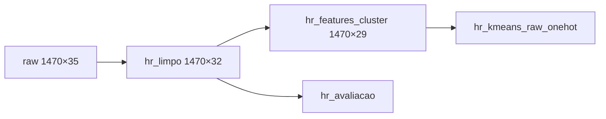

# Preparação dos dados

Código: `notebooks/03_preparacao.ipynb`
Registro de decisões: `references/decisoes_preparacao.md`

## Decisões

1. Exclusão das colunas constantes `EmployeeCount`, `StandardHours` e `Over18`
2. Exclusão de `EmployeeNumber` do conjunto de features
3. Reserva de `Attrition` e `PerformanceRating` para avaliação externa
4. Classificação das variáveis em nominais, Likert, ordinais e numéricas
5. Geração de matriz one-hot auxiliar para comparativos com K-Means/GMM

## Pipeline

## Conjuntos gerados

| Arquivo | Descrição |
|---|---|
| `data/processed/hr_limpo.csv` | Base sem colunas constantes |
| `data/processed/hr_features_cluster.csv` | Features de clusterização |
| `data/processed/hr_avaliacao.csv` | ID e rótulos de avaliação |
| `data/processed/hr_kmeans_raw_onehot.csv` | One-hot (sem scaler) |
| `data/processed/tipologia_variaveis.json` | Tipologia das variáveis |

## Próximos passos da preparação

- Cálculo da dissimilaridade de Gower
- Padronização das variáveis contínuas na via K-Means/GMM
- Definição final do conjunto de atributos (incluindo eventual PCA)
