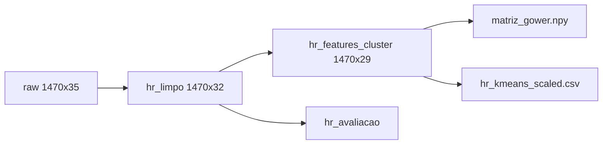

# Preparação dos dados

Código: `notebooks/03_preparacao.ipynb`, `notebooks/04_modelagem_clusters.ipynb` (fechamento Gower/scaler)
Registro: `references/decisoes_preparacao.md`

## Decisões

1. Exclusão das colunas constantes `EmployeeCount`, `StandardHours` e `Over18`
2. Exclusão de `EmployeeNumber` do conjunto de features
3. Reserva de `Attrition` e `PerformanceRating` para avaliação externa
4. Classificação das variáveis em nominais, Likert, ordinais e numéricas
5. Dissimilaridade de **Gower** sobre features mistas (gerada no notebook 04; `.npy` local, fora do Git)
6. Matriz one-hot + **StandardScaler** para vias euclidianas (K-Means, DBSCAN, PCA, GMM)
7. Discrepantes de Tukey **mantidos** (cauda de RH, não erro)

## Sensibilidade à escala

K-Means k=2 sobre a matriz one-hot:

| escalador | silhueta | ARI vs StandardScaler |
|---|---:|---:|
| StandardScaler | 0,111 | 1,00 |
| RobustScaler | 0,159 | 0,61 |
| MinMaxScaler | 0,116 | ≈ 0 |

**Decisão:** StandardScaler na via euclidiana. RobustScaler infla silhueta ao comprimir caudas de renda; MinMax produz partição distinta. O modelo oficial não depende desse scaler (usa Gower).

Tabelas: `reports/tables/preparacao_sensibilidade_escala.csv`, `preparacao_ari_escaladores.csv`.

## Pipeline

## Conjuntos gerados

| Arquivo | Descrição |
|---|---|
| `data/processed/hr_limpo.csv` | Base sem colunas constantes |
| `data/processed/hr_features_cluster.csv` | Features de clusterização |
| `data/processed/hr_avaliacao.csv` | ID e rótulos de avaliação |
| `data/processed/matriz_gower.npy` | Dissimilaridade Gower (local; `scripts/rodar_modelagem.py`) |
| `data/processed/hr_kmeans_scaled.csv` | One-hot padronizado |
| `data/processed/tipologia_variaveis.json` | Tipologia das variáveis |
