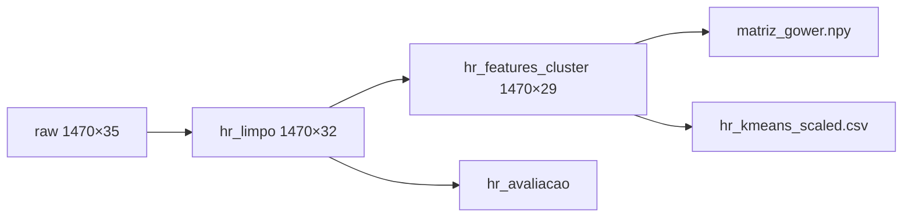

# Preparação dos dados

Código: `notebooks/03_preparacao.ipynb`, `notebooks/04_modelagem_clusters.ipynb` (fechamento Gower/scaler)
Registro: `references/decisoes_preparacao.md`

## Decisões

1. Exclusão das colunas constantes `EmployeeCount`, `StandardHours` e `Over18`
2. Exclusão de `EmployeeNumber` do conjunto de features
3. Reserva de `Attrition` e `PerformanceRating` para avaliação externa
4. Classificação das variáveis em nominais, Likert, ordinais e numéricas
5. Dissimilaridade de **Gower** sobre features mistas
6. Matriz one-hot + **StandardScaler** para vias euclidianas (K-Means, DBSCAN, PCA)

## Pipeline

## Conjuntos gerados

| Arquivo | Descrição |
|---|---|
| `data/processed/hr_limpo.csv` | Base sem colunas constantes |
| `data/processed/hr_features_cluster.csv` | Features de clusterização |
| `data/processed/hr_avaliacao.csv` | ID e rótulos de avaliação |
| `data/processed/matriz_gower.npy` | Dissimilaridade Gower (1470×1470) |
| `data/processed/hr_kmeans_scaled.csv` | One-hot padronizado |
| `data/processed/tipologia_variaveis.json` | Tipologia das variáveis |
